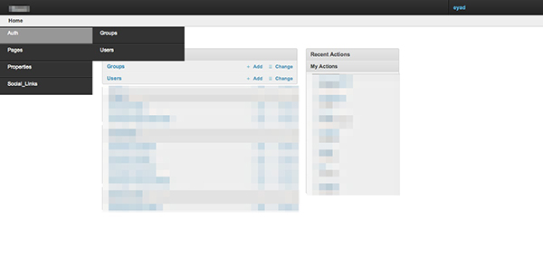

=============================
grappelli-side-menu
=============================

.. image:: https://badge.fury.io/py/grappelli-side-menu.png
    :target: https://badge.fury.io/py/grappelli-side-menu

Side menu for Grappelli, the Django admin Interface

Quickstart
----------

Install grappelli-side-menu::

    pip install grappelli-side-menu

Add "grappelli_menu" to your INSTALLED_APPS setting like this::

    INSTALLED_APPS = (
        'grappelli_menu',
        'grappelli',
        'django.contrib.admin',
        .....
    )

Add `django.core.context_processors.request` to your TEMPLATE_CONTEXT_PROCESSORS if it's not there already::

    TEMPLATE_CONTEXT_PROCESSORS = (
        .....
        "django.core.context_processors.request",
    )

Features
--------

* TODO